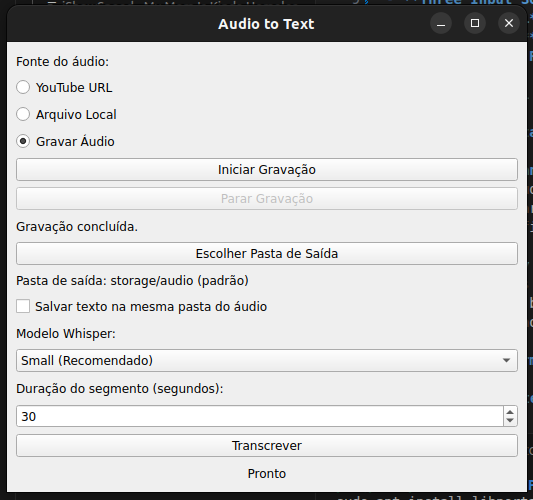

# 🎙️ Audio to Text – YouTube, Local Files & Live Recording

A powerful cross‑platform desktop application that transcribes audio from **YouTube videos**, **local media files**, or **live microphone recordings** into text. Built with Python, PyQt5, and OpenAI's Whisper, it provides an intuitive GUI with progress feedback, model selection, and customizable audio segmentation.



## ✨ Key Features

- **Three Input Sources**:
  - **YouTube URL** – download audio directly from any YouTube video.
  - **Local File** – support for common audio/video formats (MP3, WAV, MP4, etc.).
  - **Microphone Recording** – capture live speech and transcribe it instantly (requires PortAudio).

- **Whisper Model Choice** – select from `tiny`, `base`, `small`, `medium`, or `large` models to balance speed and accuracy.

- **Audio Segmentation** – split long audio into segments (10‑600 seconds) for faster, more memory‑efficient transcription.

- **Smart File Handling**:
  - Downloaded audio is named after the YouTube video title.
  - Local files are sanitized and copied/renamed to a dedicated folder.
  - Output text files are saved in a configurable location (same folder as audio or a separate folder).

- **User‑Friendly GUI**:
  - Progress bars and status messages.
  - Simple radio buttons to switch input modes.
  - Drag & drop not yet, but easy file selection.

- **Cross‑Platform** – runs on Windows, macOS, and Linux (with proper dependencies).

## 📋 Prerequisites

- **Python 3.6 or newer**
- **FFmpeg** – required for audio extraction and conversion.
- **PortAudio** (optional, for microphone recording on Linux) – if recording is needed.

### Install FFmpeg

- **Windows**: Download from [ffmpeg.org](https://ffmpeg.org/download.html) and add to PATH.
- **macOS**: `brew install ffmpeg`
- **Ubuntu/Debian**: `sudo apt update && sudo apt install ffmpeg`

### Install PortAudio (for recording on Linux)

```bash
sudo apt install libportaudio2
```

On Windows and macOS, PortAudio is usually bundled with `sounddevice`.

## 🚀 Installation

1. **Clone the repository** (or download the source):
   ```bash
   git clone https://github.com/yourusername/audio-to-text.git
   cd audio-to-text
   ```

2. **Install Python dependencies** (preferably in a virtual environment):
   ```bash
   pip install -r requirements.txt
   ```

   If you don't have a `requirements.txt`, install manually:
   ```bash
   pip install PyQt5 yt-dlp openai-whisper sounddevice numpy
   ```

   > Note: `openai-whisper` may require additional setup on some systems. See [Whisper installation guide](https://github.com/openai/whisper#setup).

3. **Run the application**:
   ```bash
   python app.py
   ```

## 🖥️ Usage

### Starting the App
Launch `app.py`. The main window appears with three radio buttons for input selection.

### Input Modes

#### 1. **YouTube URL**
- Paste a YouTube link.
- Click **Transcrever** (Transcribe). The app will download the audio, transcribe it, and save the text.

#### 2. **Local File**
- Click **Selecionar Arquivo** (Select File) and choose a media file.
- Click **Transcrever**. The file will be copied/renamed into the audio folder and transcribed.

#### 3. **Microphone Recording**
- Select **Gravar Áudio** (Record Audio).
- Click **Iniciar Gravação** (Start Recording) – speak into your microphone.
- Click **Parar Gravação** (Stop Recording) when finished.
- The recorded audio will appear as a local file; click **Transcrever** to transcribe it.

### Settings
- **Pasta de Saída** (Output Folder) – choose where to save the transcription text files.
- **Salvar texto na mesma pasta do áudio** – if checked, text files are saved alongside the audio files; otherwise they go to a separate folder (`texts` by default).
- **Modelo Whisper** – select the Whisper model size (larger models are more accurate but slower).
- **Duração do segmento** – adjust the segment length for splitting long audio (affects memory usage and speed).

### Progress & Results
A progress bar and status label show the current operation (downloading, transcribing, etc.). When finished, a dialog shows the output file path, and the text file opens automatically.

## ⚙️ Configuration

The app uses a `config.json` file (created automatically on first run) in the same directory. You can edit it to change defaults:

```json
{
  "storage": "storage",
  "audio_folder": "storage/audio",
  "text_folder": "storage/texts",
  "download_retries": 3,
  "supported_formats": [".mp3", ".wav", ".mp4", ".avi", ".mov", ".m4a", ".ogg"],
  "whisper_models": {
    "Tiny": "tiny",
    "Base": "base",
    "Small": "small",
    "Medium": "medium",
    "Large": "large"
  },
  "default_model": "base"
}
```

You can also adjust the default output folders and model selection.

## 🏗️ Building a Standalone Executable

You can package the app into a single `.exe` (Windows) or executable (macOS/Linux) using PyInstaller.

1. Install PyInstaller:
   ```bash
   pip install pyinstaller
   ```

2. Run PyInstaller with the provided spec file:
   ```bash
   pyinstaller app.spec
   ```

3. The executable will be created in the `dist/` folder. Copy any necessary files (like `ffmpeg.exe` or `cookies.txt`) alongside it if needed.

> **Note**: The `.spec` file includes hooks for Whisper and PyQt5. If you modify the code, you may need to update the `hiddenimports` list.

## ❗ Troubleshooting

### PortAudio not found / recording disabled
- **Linux**: Install `libportaudio2` as described above.
- **Windows/macOS**: Ensure `sounddevice` is installed correctly. On Windows, you may need to install the [PortAudio DLL](http://portaudio.com/) manually, but usually it's bundled.

### FFmpeg not found
- The app relies on FFmpeg for audio conversion. Make sure it's installed and accessible in your PATH, or place `ffmpeg.exe` in the same folder as the app.

### yt-dlp errors
- Some YouTube videos may require cookies or have restrictions. You can add a `cookies.txt` file (exported from your browser) in the app directory to bypass them. See [yt-dlp cookies documentation](https://github.com/yt-dlp/yt-dlp#cookies).

### Whisper model download fails
- The first time you use a model, Whisper downloads it from the internet. Ensure you have a stable connection.

## 🤝 Contributing

Contributions are welcome! Feel free to open issues or submit pull requests.

### How to Contribute
1. Fork the repository.
2. Create a new branch for your feature/fix.
3. Make your changes.
4. Test thoroughly.
5. Submit a pull request with a clear description.

## 📄 License

This project is licensed under the MIT License – see the [LICENSE](LICENSE) file for details.

---

💡 **Tip**: If you find this tool useful, consider giving it a ⭐ on GitHub!